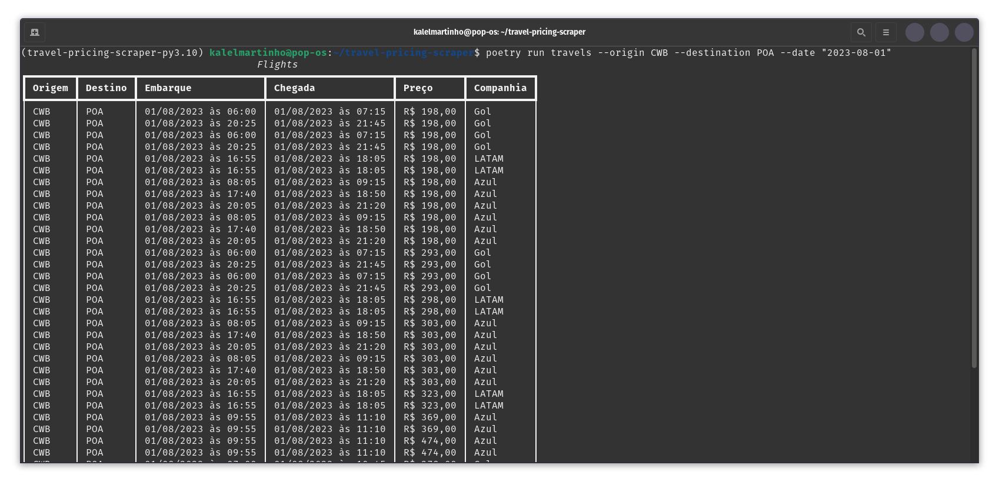
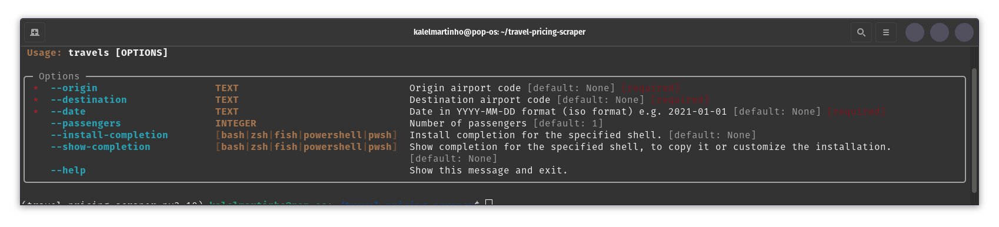

# Tutorial

If you are new to the project, you should start with this tutorial. It will guide you through the basic steps of using the library.





## How to use?
You can use scraper via command line. For example:

```bash
{{ commands.run }} travels
```
Options
```
Origin airport code: {{ vars.origin }}
Destination airport code: {{ vars.destination }}
Date in YYYY-MM-DD format (iso format): {{ vars.flight_date }}
```

OR with arguments:
```bash
{{ commands.run }} --origin {{ vars.origin }} --destination {{ vars.destination }} --date "{{ vars.flight_date }}"
```

Returns:
                                       

| Origem | Destino | Embarque            | Chegada             | Preço     | Companhia |
| ------ | ------- | ------------------- | ------------------- | --------- | --------- |
| CWB    | POA     | 01/08/2023 às 06:00 | 01/08/2023 às 07:15 | R$ 198,00 | Gol       |
| CWB    | POA     | 01/08/2023 às 16:55 | 01/08/2023 às 18:05 | R$ 198,00 | LATAM     |
| CWB    | POA     | 01/08/2023 às 09:55 | 01/08/2023 às 11:10 | R$ 369,00 | Azul      |
| CWB    | POA     | 01/08/2023 às 09:55 | 01/08/2023 às 11:10 | R$ 369,00 | Azul      |
| CWB    | POA     | 01/08/2023 às 09:55 | 01/08/2023 às 11:10 | R$ 474,00 | Azul      |
| CWB    | POA     | 01/08/2023 às 09:55 | 01/08/2023 às 11:10 | R$ 474,00 | Azul      |
| CWB    | POA     | 01/08/2023 às 11:10 | 01/08/2023 às 15:25 | R$ 278,00 | Gol       |
| CWB    | POA     | 01/08/2023 às 11:50 | 01/08/2023 às 16:15 | R$ 278,00 | Gol       |


Example in terminal:



## For further information 

You can use the flag `--help`
```bash
{{ commands.run }} --help
```

In terminal:
