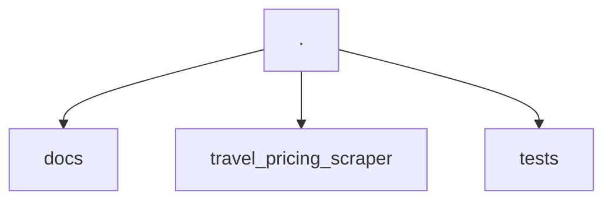
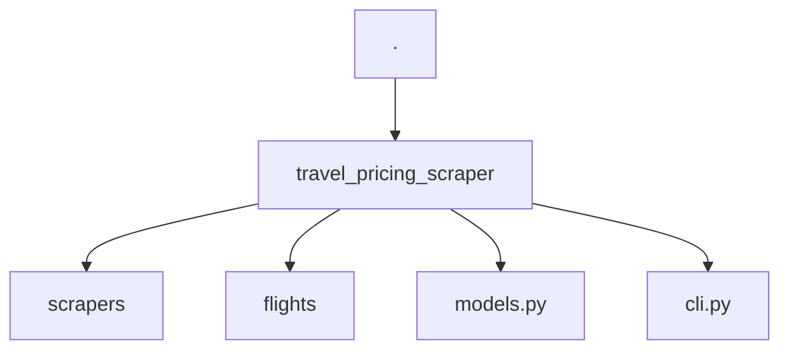
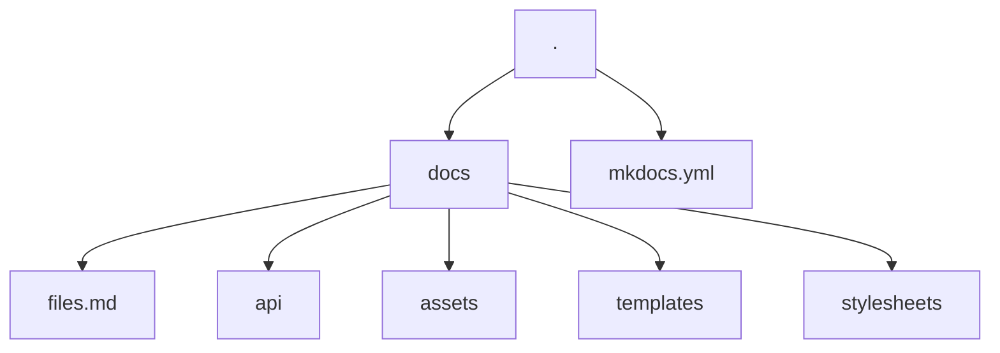

# How to contribute

Thank you for your interest in contributing to the project! We are very happy to have you here.

## How the project is organized

### Project structure

The project is organized as follows:



The project is divided into three main folders: `docs`, `travel_pricing_scraper`, and `tests`. Where each directory has its own purpose.


#### travel_pricing_scraper

The `travel_pricing_scraper` folder contains the source code of the project.



The CLI code is in `travel_pricing_scraper/cli.py`. The `scrapers` folder contains the code for the scrapers. The `flights` folder contains the code for the flights. The `models.py` file contains the code for the models used in the project. The docs of the API are in `travel_pricing_scraper` as well, with the use of [mkdocstrings.](https://mkdocstrings.github.io/) and they follow the [Google docstring style.](https://sphinxcontrib-napoleon.readthedocs.io/en/latest/example_google.html) so if you change the code, please update the docs as well.


#### About the lib

The library uses Playwright as scraper to fetch the data and returns the response as `Flight` that is a pydantic model dataclass with the following structure:

```python
class Flight(BaseModel):
    id: uuid.UUID 
    origin: str
    destination: str
    departure_date: datetime.datetime
    arrive_date: datetime.datetime
    price: float
    carrier: str
```

#### The CLI

The CLI is in `travel_pricing_scraper/cli.py` and it uses [typer](https://typer.tiangolo.com/) to create the CLI. If you want to extend the CLI you can check their docs.
To rich response of the CLI, we use [rich](https://rich.readthedocs.io/en/stable/introduction.html) if you want to extend the CLI you can check their docs.

An object of `Console` from rich and app from Typer are passed to the `main` function in `cli.py`, it is important to keep this structure to keep the CLI consistent.

```py title="travel_pricing_scraper/cli.py"
console = Console()
app = typer.Typer()
```


#### Tests

For the tests we use [pytest](https://docs.pytest.org/). The tests are in the `tests` folder and the test configuration can be found in the file [pyproject.toml](https://github.com/kalelmartinho/travel-pricing-scraper/blob/main/pyproject.toml)

Important to note about the tests are that not all tests are only located in the travel_pricing_scraper/tests directory. The addopts = "--doctest-modules" flag is being used. So, if you modify something, be aware that docstrings also run tests and serve as the basis for API documentation, so be careful with changes.

The test coverage is automatically generated using pytest-cov, and it is displayed when the test task is executed:

```bash
task test
```

Similarly, the linters are prerequisites for these tests.


#### Docs

The entire documentation is based on the usage of [mkdocs](https://www.mkdocs.org/) with the [mkdocs-material](https://squidfunk.github.io/mkdocs-material/) theme.



All the docs configuration can be found in the file [mkdocs.yml](https://github.com/kalelmartinho/travel-pricing-scraper/blob/main/mkdocs.yml) in the root of the project.

To complement the documentation, we are using [Jinja](https://jinja.palletsprojects.com/en/3.1.x/) templates, which are located in the `templates` folder in places where instructions can be repeated, if you encounter blocks like:

```jinja
{ % % }
{{ command }}
```

You can be sure that it is a jinja template.

The macros are being created using [mkdocs-macros](https://mkdocs-macros-plugin.readthedocs.io/en/latest/) and are defined in the mkdocs configuration file:

```yaml
extra:
  vars:
    project: travel_pricing_scraper
```


The `assets` folder contains the images used in the docs. The `stylesheets` folder contains the stylesheets used in the docs.. The `files.md` file contains the docs for the files in the project.


#### API documentation

The API documentation is generated using [mkdocstrings](https://mkdocstrings.github.io/) and it is located in the `api` folder. The API documentation is generated from the docstrings of the code, so if you change the code, please update the docs as well. And the files in `docs/api`has a tag:

```md
::: modulo
```

This means that the code contained in the docstrings in this block will be used.

## Tools

This project has some tools to help you to contribute to the project.

- [Poetry](https://python-poetry.org/) - Dependency manager

- [Taskipy](https://github.com/illBeRoy/taskipy) - For automating routine tasks. Run the tests, linters, documentation, etc.

So in order to contribute to the project, you need to install poetry:

```bash
pipx install poetry
```

## Steps to execute some tasks

Here are listed commands that you can use to perform common tasks. How to clone the repository, how to install dependencies, run tests, etc...

### How to clone the project

```bash
git clone https://github.com/kalelmartinho/travel-pricing-scraper.git
```

### How to install dependencies

```bash
poetry install
playwright install
```

### How to execute the CLI

```bash
{{ commands.run }} travels [subcommand]
```


### How to execute the linter

```bash
task lint
```

### How to execute the tests

```bash
task test
```


### How to execute the docs

```bash
task docs
```




## Continuous improvement

This document can be improved by anyone who has an interest in improving it. So feel free to provide more tips for people who want to contribute too :heart: